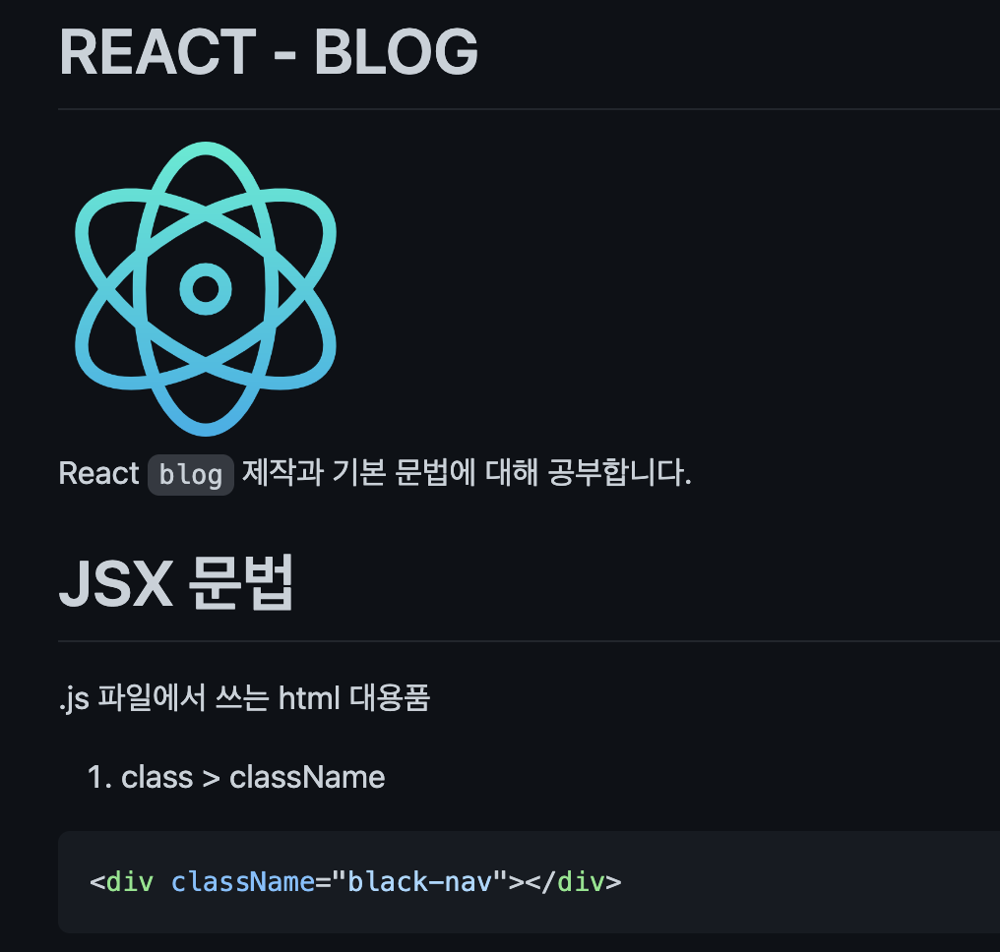
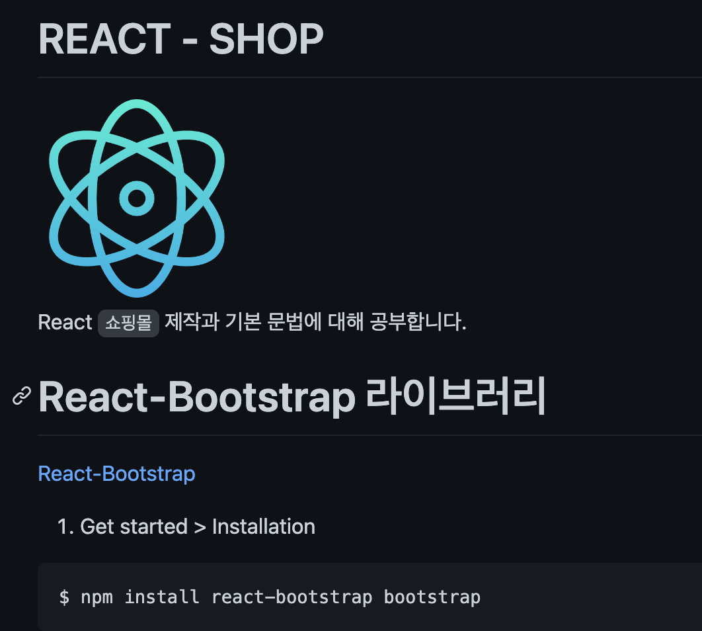

# REACT

<br/>
React 기본 문법에 대해 공부합니다.

# React 설치와 개발환경 세팅 (2022 ver)

1. Node.js 설치 (v18.11.0)
2. vscode 설치

# Project 생성

[Create React App](https://create-react-app.dev/) 라이브러리 -

1. 작업용 폴더 생성
2. 터미널

```bash
$ npx create-react-add 프로젝트명
```

3. vscode 프로젝트 폴더 오픈

# Project file 설명

- `node_modules`: 라이브러리 코드 보관함
- `public`: static 파일 보관함
- `src`: 코드 짜는 곳
- `package.json`: 프로젝트 정보

# Study Project (Folder)

1. [blog](https://github.com/khakikokyo/codingapple_react/tree/main/blog): React blog 제작과 기본 문법에 대해 공부합니다.<br/>
<br/>
2. [shop](https://github.com/khakikokyo/codingapple_react/tree/main/shop): React 쇼핑몰 제작과 기본 문법에 대해 공부합니다.<br/>
<br/>
